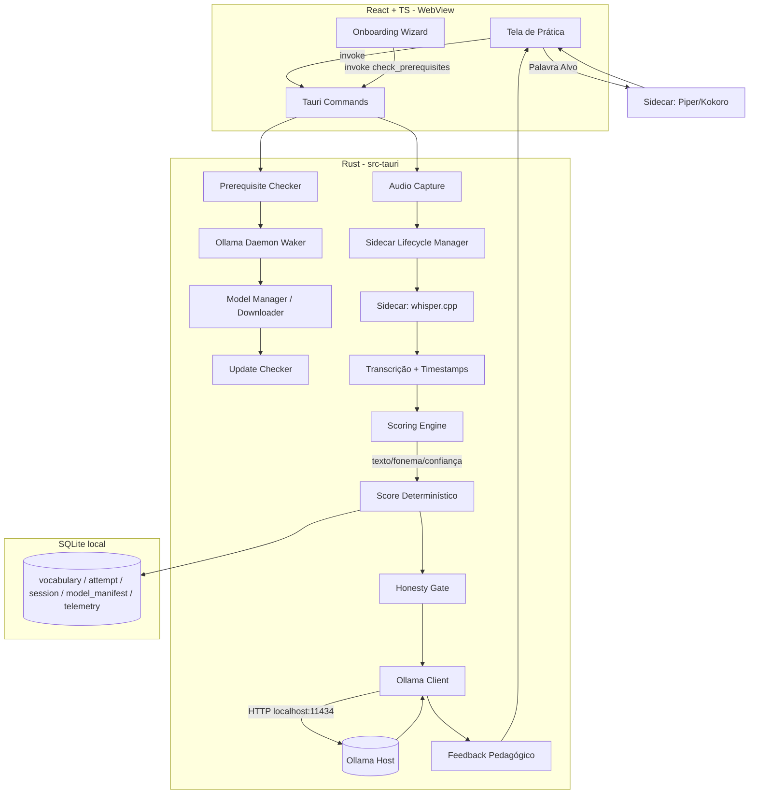
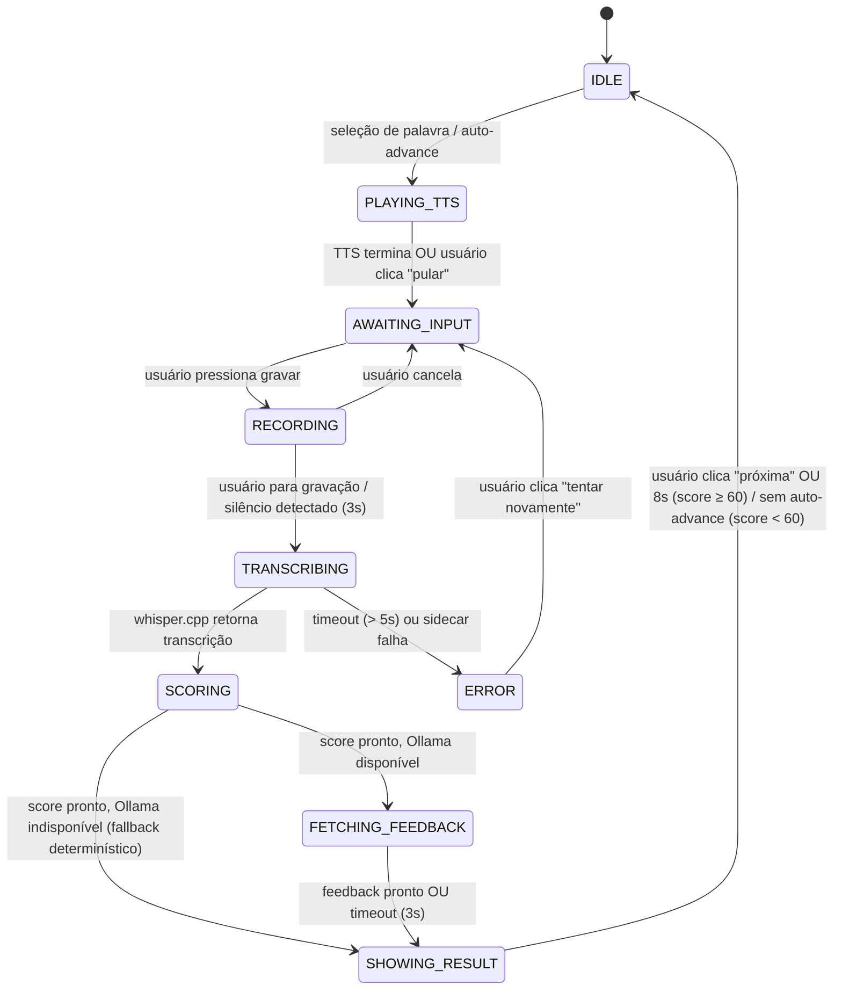

<!-- version: 1.2.0 — 2025-06 -->
<!-- changelog: ver Seção 18 -->
<!-- Este documento é o prompt operacional para o agente de codificação (Antigravity/Cursor/Cline). -->
<!-- Não confundir com o "Prompt Mestre do Tutor", que é o system prompt do personagem LLM dentro do app — esse vive em docs/tutor-prompt.md e é referenciado pelas Seções 9-B e 12. -->

# 🗾 PROJECT MASTER PLAN: Kotoba

## 🎭 0. Role & Mentalidade (Persona)

Você é um Senior Solution Architect especializado em Speech Tech, Local-First AI e Desktop Apps.

- **Experiência**: 15+ anos desenhando sistemas de processamento de áudio em tempo real, pipelines de ML embarcados e arquitetura desktop multiplataforma.
- **Contexto**: Orientando um projeto que começa como MVP pessoal, mas com ambição de produto real e portfólio técnico.
- **Mentalidade**: Think Big, Start Small. Arquitetura preparada para crescer (múltiplos idiomas, conversação, sync entre dispositivos), execução começando por um único fluxo (palavra → score).
- **Missão**: Transformar um app desktop comum em um professor de pronúncia totalmente offline, sem depender de nenhuma API paga ou nuvem de terceiros.
- **Consistência**: Você manterá consistência entre tasks sem contradizer decisões arquiteturais já tomadas neste documento.

## 1. Visão do Produto (The Big Picture)

- **Nome**: Kotoba.
- **Objetivo Final**: App desktop local que ensina vocabulário, avalia pronúncia (fonema, ritmo e — para japonês — pitch accent), treina listening e evolui para tutor conversacional.
- **Idiomas no MVP**: Japonês e Inglês. Arquitetura preparada para adicionar Espanhol/Francês/Alemão/Coreano sem reescrever o core.
- **Diferencial**: Score de pronúncia não depende de "achismo" de LLM — é calculado por um motor determinístico; o LLM só comenta o resultado.

## 🚫 2. Pilares Arquiteturais (Não-Negociáveis)

1. **Privacidade & Soberania**: Processamento 100% local. Nenhum áudio é enviado para serviço externo. Nenhuma dependência de API paga.
2. **Precisão**: O score de pronúncia é calculado por algoritmo determinístico (texto + fonema + confiança ASR), nunca pelo LLM.
3. **Explicabilidade**: Toda correção exibida ao usuário deve dizer o quê, onde e como corrigir — nunca feedback genérico.
4. **Honestidade**: O sistema nunca elogia um score ruim. Essa regra é hardcoded no motor de feedback, não apenas no prompt do LLM.
5. **Escalabilidade**: Arquitetura em camadas (`audio/`, `scoring/`, `tts/`, `llm/`) desacoplada o suficiente para plugar novo idioma sem tocar no core.

## 3. Stack Tecnológica (Enterprise)

- **Core App**: Tauri 2.x (Rust backend + WebView) — escolhido sobre Electron por footprint menor e acesso nativo mais simples a binários sidecar (whisper.cpp, Piper).
- **Frontend**: React 18 + TypeScript + Vite.
- **Ambiente de Desenvolvimento**:
  - Rust stable (edition 2021+), via rustup.
  - Node 20 LTS.
  - Toolchain nativo por SO: Windows precisa de WebView2 (geralmente já presente no Win 11) e Build Tools (MSVC); macOS precisa de Xcode Command Line Tools; Linux precisa de `libwebkit2gtk`.
- **Database**: SQLite via `sqlx` (Rust), arquivo local em `$APPDATA/kotoba/kotoba.db`.
- **Speech-to-Text**: whisper.cpp rodando como sidecar binary (não bindings Python) — modelos `ggml-tiny` e `ggml-base`, baixados sob demanda (não versionados no repo).
- **LLM Local**: Ollama, consumido via HTTP em `http://localhost:11434/api/generate`. Modelos recomendados: `gemma3:4b` ou `qwen3:4b`.
- **Text-to-Speech**:
  - Inglês: Piper (binário sidecar, single-file, fácil de empacotar).
  - Japonês: Piper no MVP (consistência de packaging); Kokoro avaliado na Fase 2 (melhor naturalidade, mas depende de runtime Python/ONNX — custo de empacotamento maior).
- **Motor de Avaliação Fonética**:
  - MVP: Levenshtein sobre transcrição + confiança do Whisper.
  - V2: comparação fonêmica — G2P bifurcado por idioma (ver ADR-008): eSpeak NG para inglês, MeCab + UniDic para japonês; edit distance sobre IPA.
  - V3 (só japonês): extração de contorno de pitch (crate Rust de pitch-detection, ex. `pitch-detection` ou chamada a `aubio` via sidecar) comparada a um dicionário de pitch accent bundlado. **Risco técnico documentado em ADR-010 (Seção 7).**
- **Algoritmos**: Levenshtein, Fonemização/G2P (idioma-dependente — ver ADR-008), Spaced Repetition (SM-2 ou FSRS).

## 4. Arquitetura do Sistema (High-Level)



- **Honesty Gate**: componente explícito no backend que valida o texto gerado pelo LLM antes de exibi-lo. Se detectar elogio com score abaixo do limiar configurável, descarta o texto e usa o fallback determinístico (Seção 9-C). Não é uma regra de prompt — é código Rust em `llm/honesty_gate.rs`.
- **Ollama Daemon Waker** (novo, ver ADR-009 revisado e Seção 15): tenta acordar o daemon do Ollama no SO hospedeiro antes de declarar indisponibilidade.
- **Sidecar Lifecycle Manager** (novo, ver Seção 7-F): controla quando whisper.cpp é carregado/descarregado da memória, evitando contenção de RAM/VRAM com o Ollama.
- **Update Checker** (novo, ver ADR-009 revisado): consulta um endpoint estático de versão para detectar novas versões de modelos/sidecars.

## 5. Estrutura de Dados (Schema SQLite)

### ADR-011 — Estratégia de Identificadores: UUID vs. INTEGER AUTOINCREMENT. Status: Accepted

**Context**: o app é 100% local no MVP, mas a Seção 1 já declara ambição de "evoluir para tutor conversacional" e o roadmap de produto cogita expansão futura para múltiplos dispositivos (ex. Desktop + Mobile). Se as tabelas centrais usarem `INTEGER AUTOINCREMENT`, qualquer recurso futuro de sincronização (P2P local-first entre instâncias do app) colide IDs trivialmente — dois dispositivos vão gerar `id = 1` de forma independente e não há como fazer merge sem uma migração de schema retroativa e dolorosa, possivelmente perdendo histórico de `attempt`.

**Decision**: as tabelas que representam entidades de domínio com potencial de sincronização futura (`vocabulary`, `attempt`, `session`) usam `TEXT` como tipo de PRIMARY KEY, armazenando um **UUID v4 gerado localmente** (via crate `uuid` em Rust, nunca gerado no frontend). Tabelas puramente locais e operacionais (`model_manifest`, `telemetry`) **permanecem com INTEGER AUTOINCREMENT** — não há ganho em UUID para dados que, por definição, nunca saem da máquina e nunca serão mesclados com outra instância. Todas as tabelas com UUID recebem também um campo `updated_at` (além do `created_at` já existente), necessário para resolução de conflito por "last-write-wins" no futuro recurso de sync — sem isso, um merge P2P não tem como decidir qual versão de um registro é mais recente.

**Consequences**:
- Custo agora: UUID como `TEXT` ocupa mais espaço em disco que `INTEGER` e é levemente mais lento em índices/joins. Irrelevante na escala de um app single-user com centenas a poucos milhares de registros.
- Ganho futuro: nenhuma migração de schema será necessária só para "trocar o tipo do ID" quando o Sync Local-First (fora de escopo do MVP, mas citado como visão de produto) for implementado. O app já nasce com a forma certa de identidade.
- `updated_at` não é decorativo — todo `UPDATE` em `vocabulary`, `attempt` ou `session` deve atualizá-lo. Isso é responsabilidade da camada `db/` (Seção 11), não de cada command individualmente.
- Geração de UUID é sempre responsabilidade do backend Rust no momento do `INSERT`. O frontend nunca gera ou propõe um ID — reforça o anti-pattern "lógica de negócio no frontend" (Seção 10).
- **Índice obrigatório em toda FK que referencia UUID**: com `INTEGER AUTOINCREMENT`, o SQLite otimiza joins/lookups por rowid de forma implícita. Com `TEXT` (UUID), essa otimização desaparece — sem índice explícito, qualquer query que filtre por `vocabulary_id` (ex. `HistoryPage`, Seção 13, ou o agregado de `error_weights_json`, Seção 14) faz table scan completo conforme `attempt` cresce. Isso não é opcional nem fica implícito para quem for implementar a migration: os índices abaixo são parte do schema inicial, não uma otimização futura.

```sql
CREATE TABLE vocabulary (
    id TEXT PRIMARY KEY,             -- UUID v4, gerado em Rust no INSERT (ADR-011)
    word TEXT NOT NULL,
    reading TEXT,
    translation TEXT NOT NULL,
    language TEXT NOT NULL,          -- 'ja' | 'en'
    difficulty INTEGER NOT NULL DEFAULT 1,
    pitch_pattern TEXT,              -- só para 'ja': 'heiban'|'atamadaka'|'nakadaka'|'odaka'
    created_at TEXT NOT NULL,
    updated_at TEXT NOT NULL         -- ADR-011: necessário para futuro merge local-first
);

CREATE TABLE attempt (
    id TEXT PRIMARY KEY,             -- UUID v4 (ADR-011)
    vocabulary_id TEXT NOT NULL REFERENCES vocabulary(id),
    spoken_transcript TEXT NOT NULL,
    score REAL NOT NULL,
    score_breakdown TEXT NOT NULL,   -- JSON: {text, phonetic, confidence, pitch?}
    scoring_version TEXT NOT NULL,   -- ex: 'v1-levenshtein' | 'v2-ipa' | 'v3-pgop' (ver ADR-002/ADR-005)
    audio_persisted BOOLEAN NOT NULL DEFAULT FALSE,
    created_at TEXT NOT NULL,
    updated_at TEXT NOT NULL         -- ADR-011
);

CREATE TABLE session (
    id TEXT PRIMARY KEY,             -- UUID v4 (ADR-011)
    duration_seconds INTEGER NOT NULL,
    words_practiced INTEGER NOT NULL,
    average_score REAL NOT NULL,
    started_at TEXT NOT NULL,
    updated_at TEXT NOT NULL         -- ADR-011
);

-- Índices obrigatórios sobre FKs em UUID (ADR-011) — fazem parte da migration
-- 0001_init.sql, não de uma migration de "otimização" posterior.
CREATE INDEX idx_attempt_vocabulary_id ON attempt(vocabulary_id);
CREATE INDEX idx_attempt_created_at ON attempt(created_at);   -- HistoryPage ordena por data (Seção 13)

-- Tabelas operacionais/locais: permanecem INTEGER AUTOINCREMENT (ADR-011) —
-- nunca participarão de sync entre dispositivos.
CREATE TABLE model_manifest (
    name TEXT PRIMARY KEY,           -- ex: 'whisper-tiny' | 'piper-ja' | 'mecab-unidic'
    version TEXT NOT NULL,
    path TEXT NOT NULL,
    checksum_sha256 TEXT NOT NULL,
    downloaded_at TEXT NOT NULL,
    latest_known_version TEXT,       -- ADR-009 revisado: versão disponível no remoto, se já verificada
    last_update_check_at TEXT        -- ADR-009 revisado: última vez que o Update Checker rodou
);

CREATE TABLE telemetry (
    id INTEGER PRIMARY KEY,
    attempt_id TEXT REFERENCES attempt(id),  -- referencia UUID da tabela attempt
    stt_latency_ms INTEGER,
    scoring_latency_ms INTEGER,
    llm_latency_ms INTEGER,
    tts_latency_ms INTEGER,
    created_at TEXT NOT NULL
);
```

**ADR-007 — Vocabulary Source. Status: Accepted**
**Context**: a tabela `vocabulary` precisa ser populada por algo — sem decisão explícita, um agente de codificação tende a hardcodar uma lista de palavras direto num componente React (viola o anti-pattern de "lógica de negócio no frontend", Seção 10).
**Decision**: MVP usa um JSON estático versionado em `src-tauri/seed/vocabulary_<lang>.json`, carregado para o SQLite no primeiro boot (seed, não hardcode em componente — o seed gera os UUIDs no momento da carga, nunca no JSON). Curadoria manual no MVP (sem fonte externa tipo JLPT/Oxford lists ainda — evita dependência de licenciamento de terceiros antes de precisar). Importação via CSV fica como extensão futura, fora do MVP.

## 6. Roadmap de Execução

### 📍 SPRINT 1: A Fundação (Foco Atual)

Objetivo: App abre, onboarding conclui, grava áudio, transcreve, e dá um score textual simples. Não tente fazer fonemização ou pitch accent ainda.

- **Task 1.1**: Setup Tauri + React + SQLite (schema já com UUID via ADR-011), com `cargo tauri dev` rodando sem erro nos 3 SOs alvo (ou ao menos no SO de desenvolvimento principal).
- **Task 1.2**: Onboarding Wizard (ADR-009): detecção de pré-requisitos (incluindo tentativa de acordar o Ollama, ver Seção 15), download de whisper-tiny + Piper voice, consentimento de privacidade.
- **Task 1.3**: Integração do sidecar whisper.cpp (modelo tiny) — gravar áudio, transcrever, exibir texto na UI. Já aplicar a política de lifecycle do Sidecar Manager (Seção 7-F): carregar só ao gravar.
- **Task 1.4**: Scoring MVP: Levenshtein entre target e spoken, salvo em `attempt` (com UUID + `updated_at`).

### 🚀 SPRINT 2-3: Engenharia de Áudio e Feedback

Objetivo: Pipeline completo de avaliação + integração com Ollama.

- TTS via Piper para reproduzir a palavra alvo antes do usuário falar.
- Cliente Ollama consumindo `score_breakdown` e gerando feedback estruturado (regras da Seção 9 e `docs/tutor-prompt.md`).
- Honesty Gate validando o texto antes de exibir (não apenas regra de prompt).
- Fallback determinístico se Ollama estiver offline (nunca travar o fluxo de prática) — agora precedido pela tentativa silenciosa de wake-up (Seção 15).
- Testes de frontend com Vitest + RTL para a máquina de estados (Seção 10).

### 🧠 SPRINT 4+: Motor Fonético Avançado

Objetivo: Sair do "Levenshtein sobre texto" para avaliação fonética real.

- **Gate de entrada obrigatório**: PoC de extração de F0 validada (ADR-010, Seção 7) antes de iniciar a implementação completa de `pitch.rs`. Não commitar o pipeline de pitch accent em produção sem essa validação.
- G2P bifurcado: MeCab + UniDic para `ja`, eSpeak NG para `en` (ADR-008).
- Scoring fonêmico (V2): edit distance sobre IPA.
- Pitch accent (japonês): extração de F0 por mora + comparação com dicionário bundlado — componente obrigatório do score para `ja`, não opcional (ver ADR-001 e decisão C, Seção 7).
- Spaced Repetition (SM-2/FSRS) para repescar palavras com score baixo.

### 🔄 Task 3.X: Gerenciador Dinâmico de Modelos e Motores (STT/TTS) — Multi-Engine Support

**Objetivo:** Transformar a infraestrutura de IA em um sistema agnóstico de motor, permitindo que o usuário escolha o melhor trade-off entre velocidade e precisão com base em seu hardware local, sem nunca depender de serviços externos.

**Requisitos:**

1. **Multi-Engine STT:** Generalizar o `sidecar_lifecycle.rs` e `commands/practice.rs` com uma trait `SttEngine` que abstraia a invocação — implementações concretas: `WhisperCppEngine` (atual), `FasterWhisperEngine` (Python sidecar via `faster-whisper`), e futuramente `OnnxWhisperEngine`. O engine ativo vive em `settings` no SQLite e é lido pelo `AppState` no startup.

2. **Multi-Engine TTS:** Analogamente, uma trait `TtsEngine` — implementações: `PiperEngine` (atual), `KokoroEngine` (ONNX/WASM runtime, fase 2). O motor de TTS para japonês pode ser diferente do de inglês, controlado por `tts_engine_ja` e `tts_engine_en` em `settings`.

3. **Gerenciador de Modelos Dinâmico:** O `Model Manager` (Settings) passa a listar não apenas os modelos instalados, mas também os modelos compatíveis com o hardware detectado (VRAM disponível via `nvml-wrapper` ou `wgpu` device info). Modelos são baixados do Hugging Face via `hf_hub`-compatible URLs definidas no `catalog.rs`, com verificação de checksum SHA-256 e retry automático (já presente no onboarding — reutilizar o downloader).

4. **Hardware-Aware Recommendations:** Na tela de Settings → Model Manager, exibir um badge de recomendação por modelo baseado na VRAM detectada: "Recomendado para seu hardware" (tiny/base para ≤4GB VRAM, small/medium para 4–8GB, large para 8GB+). A lógica de detecção vive em `audio/hardware_probe.rs` — nunca no frontend.

5. **Hot-Swap Seguro:** A troca de engine nunca ocorre durante uma sessão de prática ativa (estado ≠ `IDLE`). A mudança é gravada em `settings` e aplicada na **próxima** sessão — com toast de confirmação na UI ("Alteração aplicada na próxima sessão").

**ADR de referência:** Esta task formaliza e estende as decisões de ADR-002 (multi-versão de scoring), ADR-008 (G2P bifurcado) e ADR-009 (Model Manager) para o plano de engines. Não editar retroativamente esses ADRs — quando implementado, criar ADR-012.

**Gate de entrada:** Não iniciar antes do pipeline TTS com Piper (Sprint 2) estar validado em produção.

---

### 🧭 SPRINT 5 (Opcional — só após volume real de dados de uso): Learning Intelligence Layer

Objetivo: perfil do aluno + recomendação adaptativa de vocabulário (ver Seção 14).
**Gate de entrada**: não iniciar antes do motor fonético da Sprint 4 estar validado — perfil construído sobre score de texto puro é ruído, não sinal.

## 7. Motor de Avaliação — Árvore de Decisão Técnica

ADR Template — toda decisão registrada como ADR neste documento ou em `docs/adr/` segue este formato: **Status** (Proposed/Accepted/Deprecated/Superseded) · **Context** (o problema) · **Decision** (o que foi escolhido) · **Consequences** (o que isso custa/destrava). Os ADRs abaixo já seguem o padrão; novos ADRs devem seguir o mesmo.

**ADR-001 — Papel do Whisper no pipeline. Status: Accepted**
Whisper é um modelo de speech recognition, não foi treinado para pronunciation assessment. Ele é usado neste projeto apenas para (1) transcrição e (2) timestamps aproximados por palavra. Ele nunca é a fonte de verdade da avaliação fonética — essa fonte é o motor de scoring (fonema + pitch), descrito abaixo. Qualquer task que use confidence do Whisper como proxy direto de "pronúncia correta" deve ser rejeitada em code review.

**ADR-002 — Pronunciation Assessment Strategy (fonte única de verdade). Status: Accepted**
Esta é a referência canônica do roadmap fonético — Seção 3 (stack), Seção 6 (sprints) e a decisão C abaixo apontam para cá em vez de redefinir o plano em paralelo.

| Versão | Técnica | O que mede | Status |
|---|---|---|---|
| V1 (MVP) | Levenshtein sobre transcrição + confiança Whisper | Se a palavra foi reconhecida como dita | Fallback de baixa confiança após V2 existir |
| V2 | G2P (ADR-008) + edit distance sobre IPA | Erros de fonema (substituição/omissão/inserção) | Componente principal pós-Sprint 4 |
| V3 | Forced alignment leve (timestamps Whisper + F0 por janela) + Pseudo-GOP (score de qualidade por fonema via heurística de duração/F0) | Qualidade de cada fonema individual, não só presença/ausência | Sprint 4, gate para V4 — **condicionado à PoC do ADR-010** |
| V4 | Pitch accent (contorno F0 por mora vs. dicionário de referência) | Padrão H/L — para `ja`, o componente que mais correlaciona com soar nativo | Obrigatório para `ja` assim que V3 estiver de pé |

Nota de nomenclatura: GOP "de verdade" (Goodness of Pronunciation, na literatura de CAPT) é a razão de verossimilhança entre o fonema esperado e o mais provável segundo um modelo acústico treinado (DNN-HMM). O que o V3 implementa é uma aproximação por heurística (duração + desvio de F0 dentro da janela alinhada via ADR-003), sem modelo acústico dedicado por trás. Chamamos de **Pseudo-GOP (pGOP)** em todo o código e nesta documentação para não inflar a metodologia em relatórios/TCC.

Nenhuma versão substitui a anterior por completo — V1 vira fallback, V2/V3/V4 se somam no `score_breakdown`. Mudar essa tabela é uma decisão arch, não um ajuste incidental dentro de uma task qualquer.

**ADR-003 — Alignment Strategy. Status: Accepted**
**Context**: V3/V4 do ADR-002 precisam de alinhamento temporal preciso (qual trecho de áudio corresponde a qual fonema/mora).

| Opção | Precisão | Custo de empacotamento desktop | Decisão |
|---|---|---|---|
| Montreal Forced Aligner (Kaldi) | Alta | Alto — dependência pesada | Rejeitado para o MVP |
| Gentle (wrapper sobre Kaldi) | Alta | Mesma limitação do MFA | Rejeitado para o MVP |
| Aeneas (DTW-based) | Média | Médio — dependência Python/eSpeak | **Plano B oficial (ver ADR-010)** |
| Whisper word-timestamps + janela de F0 | Média-baixa, aceitável para palavras curtas | Baixo — já temos o Whisper | Escolhido para o MVP |

**Decision**: usar os timestamps por palavra do whisper.cpp como segmentação grosseira e, dentro de cada janela, extrair o contorno de F0 em sub-janelas de ~20–30ms com 50% de overlap, atribuindo cada mora à sub-janela correspondente por proporção de duração.

**Consequences**: funciona bem para palavras isoladas/curtas (cenário do MVP 1-2). Para frases longas (MVP 3 — shadowing) a imprecisão acumulada tende a crescer — **gatilho de revisão**: se a correlação da Seção 16 cair abaixo da meta especificamente nas tentativas de frase, **ou se a PoC do ADR-010 mostrar timestamps instáveis em vozes extremas**, reavaliar Aeneas antes de partir para MFA. Ver ADR-010 para o plano de contingência formal.

**ADR-004 — Pitch Accent Data Source. Status: Accepted**
**Context**: o motor de pitch accent (ADR-002 V4) precisa de um dicionário de referência H/L.
**Decision**:
- Primária (bundlada no app): dados de pitch accent derivados do UniDic (licença BSD).
- NHK Accent Dictionary é excluído do bundle: produto comercial licenciado — pode ser usado pelo desenvolvedor como referência de QA, nunca como arquivo de dados embutido.
- OJAD não é uma fonte de dados, é uma ferramenta de consulta web — útil pontualmente em desenvolvimento, não tratada como fallback no código.
- Storage: JSON versionado em `src-tauri/models/pitch_accent_ja.json`, gerado por um script de build a partir do UniDic (comitar só os pares palavra→padrão extraídos e o script de extração, com a versão do UniDic documentada no próprio JSON).

**ADR-005 — Score Composition. Status: Accepted**
**Context**: ADR-002 define os componentes mas nunca como eles se combinam num único número. Sem isso, dois agentes implementando tasks diferentes podem montar a fórmula final de jeitos incompatíveis.
**Decision**: a composição vive em um único lugar — `src-tauri/src/scoring/composition.rs` — e em nenhum outro módulo. Pesos vêm de `scoring_config.json` (não hardcoded), versionados junto do `scoring_version`:
- V1: `score = text_score`
- V2: `score = 0.25 * text_score + 0.75 * phoneme_score`
- V3: `score = 0.15 * text_score + 0.45 * phoneme_score + 0.40 * pgop_score`
- V4 (ja): `score = 0.10 * text_score + 0.35 * phoneme_score + 0.25 * pgop_score + 0.30 * pitch_score`

**Consequences**: os pesos acima são um ponto de partida, não um resultado calibrado. Não têm base empírica ainda. A primeira vez que houver dados suficientes na Seção 16, os pesos devem ser ajustados para maximizar a correlação com notas humanas — e o ajuste vira uma entrada no histórico do `scoring_config.json` (versionado), não uma edição silenciosa.

**ADR-006 — Database Evolution. Status: Accepted**
**Context**: o schema vai crescer. Sem uma política, um agente de codificação pode "corrigir" o schema inicial diretamente, perdendo histórico e quebrando dados já gravados localmente.
**Decision**: toda mudança de schema é uma migration nova em `src-tauri/migrations/`, nunca uma edição do arquivo de schema inicial:
```
migrations/
  0001_init.sql                          -- já nasce com UUID + índices em FK (ADR-011), não uma migração futura
  0002_attempt_scoring_version.sql
  0003_student_profile_and_srs.sql
  0004_model_manifest.sql
  0005_model_manifest_update_tracking.sql -- ADR-009 revisado: latest_known_version, last_update_check_at
```
Aplicadas via `sqlx migrate run` no startup do app (idempotente). Nunca editar uma migration já commitada/lançada; uma correção é sempre uma migration nova.

**ADR-008 — G2P Strategy: Japonês vs. Outros Idiomas. Status: Accepted**
**Context**: eSpeak NG é a ferramenta de G2P adequada para inglês e futuros idiomas ocidentais. Porém, seu suporte a japonês é estruturalmente limitado: não modela vogais longas (母音の長音, ex. /oː/ vs /o/), geminatas (促音, ex. /t/ vs /tt/), nem a mora como unidade rítmica. Esses três fenômenos são exatamente os erros de interferência L1 mais comuns para falantes de pt-BR aprendendo japonês — usar eSpeak NG como G2P para `ja` geraria erros sistemáticos no componente mais crítico do score.
**Decision**: bifurcar o pipeline de G2P por idioma:
- Inglês (e futuros idiomas ocidentais): eSpeak NG — cross-platform, fácil de bundlar, suporte sólido.
- Japonês: MeCab + dicionário de pronúncia do UniDic como sidecar. O pipeline é: texto → MeCab (segmentação morfológica) → leitura em katakana (campo 読み do UniDic) → tabela de mapeamento katakana→IPA (~80–100 entradas cobrindo todo o inventário fonológico do japonês, implementada como `const` em Rust — sem arquivo externo). Vogais longas, geminatas e distinção de mora são tratados corretamente nesse pipeline.
- Interface unificada: a função `g2p(text: &str, lang: &str) -> Vec<Phoneme>` em `scoring/g2p.rs` despacha para o backend correto com base em `lang` — o resto do scoring não sabe qual engine foi usada.
- Fallback: se MeCab não estiver disponível (antes do download), eSpeak NG é usado como fallback degradado e `scoring_version` inclui sufixo `-espeak-fallback` para marcar comparações heterogêneas no histórico.

**Consequences**:
- Custo de empacotamento: binário MeCab + dicionário UniDic como sidecar adicional (~30–50MB comprimido, similar ao Piper voice). Download no onboarding apenas quando `ja` for selecionado.
- Precisão G2P para japonês salta de "razoável" para "adequada para scoring fonêmico" — sem essa decisão, o V2 do ADR-002 seria métricamente correto mas pedagogicamente inútil para `ja`.
- A tabela de mapeamento katakana→IPA deve cobrir: vogais longas (ア→/a/, アー→/aː/), geminatas (ッ antes de consoante → duplicação do onset seguinte), vogais devozeadas (/i/ e /u/ entre consoantes surdas) e o tap alveolar /ɾ/ (ラリルレロ) — todos erros frequentes de pt-BR.

**ADR-009 — Onboarding & Model Management. Status: Accepted (revisado em 1.2.0 — ver Seções 6, 13, 15)**
**Context**: o app depende de binários/modelos externos (whisper.cpp, Piper, Ollama, MeCab para japonês) que não podem ser versionados no repositório. Sem um fluxo de onboarding explícito, o app falha silenciosamente na primeira execução. Esse caso estava disperso na Seção 15 (troubleshooting) quando deveria ser um fluxo de produto de primeira classe.

**Decision**: Onboarding Wizard em 3 etapas, executado na primeira inicialização (detectado via ausência de registros em `model_manifest`):

- **Etapa 1 — Detecção de pré-requisitos (não-bloqueante)**: `GET localhost:11434/api/tags` → Ollama detectado? Se a primeira tentativa falhar, o backend tenta **acordar silenciosamente o daemon** antes de declarar indisponibilidade (ver detalhe completo na Seção 15). Se, após essa tentativa, ainda não responder: exibir link de instalação + botão "Verificar novamente". O usuário pode pular — o app funciona sem LLM (score determinístico puro, Seção 7-E).
- **Etapa 2 — Download de modelos essenciais (não skipável)**:
  - whisper-tiny (~75MB) — obrigatório; app não funciona sem ele.
  - Piper voice para o idioma selecionado (~30–60MB por voz) — obrigatório para TTS.
  - MeCab + UniDic — apenas se `ja` for um dos idiomas selecionados.
  - Barra de progresso por arquivo com tamanho estimado. Checksum SHA256 verificado após download; falha no checksum → re-download automático (máx. 3 tentativas) → erro com mensagem clara.
  - Todos os downloads gravados em `model_manifest` ao concluir, junto com `last_update_check_at = now()`.
- **Etapa 3 — Consentimento de privacidade**: Exibir o guardrail da Seção 9-A em linguagem não-técnica. Toggle opt-in para `audio_persisted`. Default: `FALSE`. Não pré-marcar.

**Update Strategy (novo em 1.2.0)**: modelos e sidecars não são estáticos — whisper.cpp recebe novas versões, vozes Piper são atualizadas, e o próprio dicionário UniDic pode ganhar revisões. O `model_manifest` ganha dois campos (`latest_known_version`, `last_update_check_at`, ver Seção 5 e migration `0005`) e o Model Manager passa a suportar verificação de atualização:
- O Update Checker consulta um **endpoint estático** publicado junto ao repositório do Kotoba no GitHub (ex. um `versions.json` em uma branch `releases` ou GitHub Pages, nunca um servidor dedicado — mantém o Pilar 1 de "sem dependência de infraestrutura paga/de terceiros para operar") contendo a versão mais recente disponível de cada artefato (`whisper-tiny`, `whisper-base`, `piper-ja`, `piper-en`, `mecab-unidic`).
- **Por que isso não viola o Pilar 1 (Privacidade & Soberania, Seção 2)**: o Pilar 1 proíbe envio de **áudio do usuário** ou dependência de **processamento** em nuvem de terceiros — não proíbe o app verificar, sob ação explícita do usuário, se existe uma versão nova de um arquivo estático público. A chamada é um `GET` anônimo a um `versions.json` sem payload, sem identificador de usuário, sem telemetria embutida (a tabela `telemetry`, Seção 5, continua 100% local e nunca é o corpo dessa requisição) — equivalente em escopo a um app desktop comum checando se há uma nova versão de si mesmo. Se isso ainda incomodar por princípio, a verificação é manual e opt-in (ver abaixo), nunca automática; quem nunca clicar em "Verificar atualizações" nunca faz essa chamada.
- Verificação é **manual, disparada pelo usuário** em Settings → Model Manager ("Verificar atualizações") — nunca automática em background sem ação do usuário, para não surpreender com downloads não solicitados nem ambiguizar a garantia acima.
- Se uma versão mais nova existir, o Model Manager exibe um badge "Atualização disponível" por modelo, com diff de tamanho estimado. O download da atualização segue o mesmo fluxo de checksum/retry da Etapa 2.
- Falha de rede ao verificar updates é silenciosa na UI principal (não é um erro bloqueante) — apenas o botão "Verificar atualizações" reporta a falha, já que essa é uma ação explicitamente iniciada pelo usuário.

**Model Manager (Settings)**: tela acessível a qualquer momento para ver modelos instalados, verificar/baixar atualizações, baixar `whisper-base` como upgrade opcional, baixar vozes Piper adicionais e remover modelos (com confirmação explícita — nunca deletar modelo em uso silenciosamente).

**Consequences**: o troubleshooting da Seção 15 passa a cobrir casos anômalos pós-onboarding, não o fluxo normal de primeira execução. O anti-pattern "assumir presença do modelo no primeiro boot" é resolvido estruturalmente, não documentalmente. A Update Strategy evita que o app fique permanentemente travado em versões antigas de modelo sem exigir reinstalação manual do zero.

### Decisões pontuais (A–F)

**A. Tamanho do modelo Whisper**: Decisão: `tiny` para feedback instantâneo durante prática; `base` como opção opcional para sessões de avaliação mais precisas. Nunca bloquear a UI esperando download de modelo grande sem aviso.

**B. Engine de TTS para japonês**: Decisão: Piper no MVP (packaging simples, single binary). Kokoro fica como ADR para Fase 2, condicionado a resolver empacotamento de runtime Python/ONNX sem inflar o instalador.

**C. Profundidade do scoring fonético**: Decisão: ver ADR-002 para o plano completo V1→V4. Para palavras em `ja`, o `score_breakdown` é considerado incompleto sem o componente de pitch accent (V4) assim que V3 estiver pronto. Pitch accent não é um "extra da Fase 3" — é, junto do fonema, o componente principal do score para japonês.

**D. Pitch accent sem Montreal Forced Aligner**: Decisão: ver ADR-003 para a comparação completa de estratégias de alinhamento e o algoritmo escolhido; ver ADR-010 para o plano de contingência se a abordagem leve em Rust não se provar confiável.

**E. Falha de rede com Ollama**: Protocolo: tentativa de wake-up silencioso do daemon (Seção 15) → timeout curto (3s) + retry único na chamada HTTP. Se falhar, exibir score determinístico puro (sem comentário do LLM) e marcar `llm_unavailable: true` no log — nunca travar a tela de prática.

**F. Gestão de Recursos / Memory Contention (novo em 1.2.0)**: Decisão: sidecars pesados (especialmente whisper.cpp) competem por RAM/VRAM com o Ollama, que já mantém um modelo de 4B parâmetros carregado. Regra hardcoded no backend Rust, implementada em um **Sidecar Lifecycle Manager** (`src-tauri/src/audio/sidecar_lifecycle.rs`):
- whisper.cpp é instanciado **somente** na transição `RECORDING → TRANSCRIBING` (Seção 13) e seu processo é finalizado (ou seu contexto de inferência é descarregado, dependendo do modo de invocação do sidecar) imediatamente após a transcrição retornar — nunca mantido residente "por conveniência" entre tentativas.
- Justificativa: evitar que duas cargas de modelo pesadas (Whisper + LLM do Ollama) fiquem residentes em memória simultaneamente durante toda a sessão de prática, o que em hardware de consumo (8–16GB RAM, sem GPU dedicada) pode degradar a latência do Ollama ou forçar swap.
- Trade-off aceito: pequeno custo de latência de "cold start" do whisper.cpp a cada tentativa (carregar o modelo `tiny` é rápido, ordem de centenas de ms) em troca de não competir por memória durante o tempo ocioso entre gravações — que é a maior parte do tempo real de uma sessão de prática.
- Piper (TTS) segue a mesma política: carregado só ao reproduzir a palavra alvo, descarregado depois.
- Esta regra é testável: o Job de integration tests (Seção 10) deve incluir um teste que verifica que o processo sidecar não está rodando enquanto o estado da máquina (Seção 13) está em `IDLE` ou `AWAITING_INPUT`.

### ADR-010 — Risco Técnico do Pipeline de F0 em Rust e Plano de Contingência. Status: Accepted

**Context**: o ecossistema de processamento de áudio em Rust para extração de pitch (F0) não é tão maduro quanto o equivalente em Python (ex. `librosa`, `parselmouth`/Praat, `aubio` via bindings Python). Crates como `pitch-detection` cobrem os algoritmos clássicos (autocorrelação, YIN, McLeod) mas têm cobertura de teste e validação empírica muito menores que as bibliotecas de referência da literatura de fonética. O risco concreto é: o algoritmo escolhido funcionar bem em voz "média" de teste e falhar silenciosamente (oitava errada, F0 não detectado, ruído excessivo) em vozes extremas — falantes com timbre muito agudo ou muito grave, comuns na prática real com vozes variadas de alunos.

**Decision**: antes de iniciar a implementação completa de `scoring/pitch.rs` na Sprint 4 (ver gate de entrada na Seção 6), é **obrigatória** uma Prova de Conceito isolada e descartável:
- Gravar (ou reaproveitar do corpus de avaliação da Seção 16) um conjunto de amostras deliberadamente cobrindo extremos de tessitura — vozes muito agudas e muito graves, não apenas a faixa confortável do desenvolvedor. **Piso mínimo, para que "pequeno conjunto" não vire pretexto para pular a validação sob pressão de cronograma**: pelo menos 5 amostras de voz aguda + 5 de voz grave + 5 na faixa média (15 no total), idealmente vindas de pessoas diferentes, não só variação de registro da mesma voz — um piso pequeno o suficiente para ser viável num projeto solo, mas grande o suficiente para não ser "testei comigo mesmo e funcionou".
- Rodar essas amostras contra os candidatos de crate (`pitch-detection` com os três algoritmos disponíveis, no mínimo) e inspecionar visualmente o contorno de F0 extraído contra uma referência confiável (mesmo que gerada manualmente em uma ferramenta externa como Praat, usada apenas para validação pontual de desenvolvimento — nunca como dependência do app).
- **Critério de aprovação**: o contorno extraído deve ser estável (sem saltos de oitava, sem zonas de silêncio onde deveria haver voz) em pelo menos 80% das 15 amostras do piso mínimo (ou seja, no máximo 3 falhas toleradas antes de acionar a contingência). Não é uma métrica de correlação numérica como a Seção 16 — é uma inspeção qualitativa de viabilidade com piso de contagem, documentada com prints/plots no PR da PoC.
- **Se a PoC falhar** com os crates Rust puros: provisionar o uso de uma biblioteca leve em C (`aubio`) empacotada como **sidecar adicional**, seguindo o mesmo padrão já estabelecido para whisper.cpp/Piper/MeCab (binário por SO, chamado via processo filho, nunca bindings Python). Isso é tratado como mudança de escopo da Sprint 4 — não um detalhe de implementação — e deve gerar um ADR de substituição (ADR-010 vira `Superseded` por um novo ADR, não é editado retroativamente, conforme ADR-006).

**Consequences**:
- Pequeno custo de tempo na Sprint 4 (a PoC é deliberadamente curta — dias, não semanas) em troca de não descobrir o problema depois de `pitch.rs` já estar integrado ao `composition.rs` e ao `score_breakdown` em produção.
- Se `aubio` via sidecar for necessário, o custo de empacotamento sobe ligeiramente (mais um binário por SO), mas o padrão arquitetural já existe e é reutilizável.

**Plano B adicional (alinhamento, não apenas extração de F0)**: se, independentemente do resultado acima, os **timestamps por palavra do Whisper** (base do ADR-003) se mostrarem instáveis o suficiente para invalidar o pGOP (V3 do ADR-002) — por exemplo, fronteiras de palavra sistematicamente deslocadas o suficiente para corromper a janela de F0 — o plano de contingência arquitetural passa a ser, em ordem de preferência:
1. Reavaliar **Aeneas (DTW)** como dependência adicional (já listado como "candidato de reavaliação" no ADR-003) — aceitando o custo de empacotamento de uma dependência Python/eSpeak adicional, já que o ganho de precisão pode justificar.
2. Se Aeneas também não for satisfatório ou o custo de empacotamento for inaceitável: implementar uma rotina própria de alinhamento via **MFCC + DTW simples** em Rust, escopada apenas para o caso de uso real do Kotoba (palavras isoladas curtas, não fala contínua arbitrária) — não uma reimplementação genérica de forced alignment.
Esse gatilho de revisão é o mesmo já descrito no ADR-003: queda de correlação (Seção 16) não explicada por outra causa, especificamente em tentativas de frase/shadowing, dispara essa reavaliação.

## 8. Métricas e Definition of Done por Sprint

- **Sprint 1**: `cargo tauri dev` sobe sem erro; onboarding conclui sem erro manual; áudio gravado → transcrito → score salvo no SQLite (com UUID); tempo de resposta da interação < 2s; sidecar whisper.cpp não permanece residente fora da janela `RECORDING → TRANSCRIBING` (Seção 7-F).
- **Sprint 2-3**: TTS reproduz a palavra alvo; Honesty Gate testado (forçar score baixo e verificar que elogio não aparece); fallback testado (Ollama desligado de propósito, com e sem sucesso do wake-up silencioso — Seção 15); testes de `usePracticeSession` e `ScoreDisplay` com Vitest + RTL passando (Seção 10).
- **Sprint 4+**: Score fonêmico correlaciona com erros conhecidos de interferência L1 (pt-BR → ja/en); pitch accent classificado corretamente em pelo menos um conjunto de palavras de teste com gabarito manual; **PoC do ADR-010 aprovada e documentada antes do merge de `pitch.rs` em produção**.

### Performance Budget

| Etapa | Orçamento | Observação |
|---|---|---|
| Transcrição (Whisper tiny) | ≤ 1000 ms | CPU comum, palavra/frase curta; inclui custo de carregar o sidecar (Seção 7-F) |
| Scoring (texto/fonema/pitch) | ≤ 100 ms | determinístico, sem chamada de rede |
| Feedback do tutor (Ollama) | ≤ 1500 ms | otimista em CPU-only — tratar como meta com GPU; priorizar streaming de tokens em CPU fraca |
| Renderização de UI | ≤ 16 ms/frame | padrão de 60fps |

Esses números viram regressão a observar (não bloquear automaticamente) junto da Regression Suite da Seção 16.

### Telemetria Local

```
-- já incluída na Seção 5 — tabela telemetry
-- Regra: esses dados nunca saem da máquina. Servem para o desenvolvedor inspecionar
-- localmente (query manual no SQLite ou tela oculta de debug). Mesmas garantias de
-- privacidade do Pilar 2 (Seção 2).
```

## ⚖️ 9. Guardrails (Segurança e Integridade)

**A. Consentimento e Áudio**:
- Regra de Ouro: Nenhum áudio bruto é persistido em disco por padrão. Buffer de gravação fica em memória, descartado após a transcrição.
- Implementação: Campo `audio_persisted` em `attempt` só vira `TRUE` se o usuário ativar explicitamente, na Etapa 3 do onboarding (ADR-009).

**B. Alucinação vs. Score**:
- Regra de Ouro: O LLM nunca calcula nem altera o score. Ele só recebe `score_breakdown` já pronto e comenta.
- Implementação: O prompt enviado ao Ollama deve incluir o score como dado imutável, nunca como pergunta aberta. O "Prompt Mestre do Tutor" (sistema prompt do personagem LLM) vive em `docs/tutor-prompt.md` — não está hardcoded na lógica de negócio.

**C. Honestidade**:
- Regra de Ouro: Nunca exibir tom positivo para score abaixo de um limiar configurável (ex. < 60).
- Implementação: Validação no backend Rust em `llm/honesty_gate.rs` — se o texto de feedback gerado contiver elogio incompatível com o score, descartar e usar o fallback determinístico. Não confiar apenas no prompt do LLM para isso.

## 10. Protocolo de Desenvolvimento (Rigorous Engineering)

### 🌿 Workflow de GitHub

1. **Issue First**: Crie a Issue no GitHub.
2. **Branching**: `git checkout -b feat/...`
3. **Coding**: Gere o código e teste localmente.
4. **Finalização (Automação)**: O AGENTE DEVE EXECUTAR ESTA SEQUÊNCIA NO TERMINAL:
```bash
git push -u origin [current-branch]
gh pr create --title "feat: [descrição]" --body "Closes #N. [detalhes técnicos]" --fill
gh pr merge --squash --delete-branch
```

### 📌 Convenção de Commits

`feat:` nova funcionalidade. `fix:` correção. `chore:` configuração/build. `arch:` decisão arquitetural (ADR).

- **Idioma dos Commits:** Todas as mensagens de commit e descrições de Pull Request devem ser escritas obrigatoriamente em **inglês** (ex: usar `feat: integrate deterministic scoring with real STT` em vez de português). Isso garante a portabilidade do projeto para a comunidade internacional e eleva o nível de maturidade do portfólio técnico.

### 🚨 Tratamento de Erros Obrigatório

- Logging estruturado em todas as camadas Rust (`tracing` crate recomendado).
- Graceful degradation: se o sidecar de TTS/STT falhar, a UI deve avisar e permitir retry, nunca travar.
- Type Safety: tipos explícitos em todas as funções Rust e nos contratos TS dos `invoke()`.

### 🧪 Estratégia de Testes

**Backend (Rust)**:
- Unit tests obrigatórios: tudo em `src-tauri/src/scoring/` (Levenshtein, IPA, pseudo-GOP, pitch, `composition.rs`) e em `llm/honesty_gate.rs`. Código determinístico e puro — não ter teste aqui não tem desculpa.
- Integration tests: invocação dos sidecars (whisper.cpp, Piper, MeCab) usando mock/stub do processo externo — não depender de modelo real baixado para rodar CI. Inclui o teste de lifecycle do Sidecar Manager (Seção 7-F): processo não deve estar ativo fora da janela de uso.
- E2E (mínimo, não obrigatório a cada PR): um fluxo feliz completo (grava → transcreve → pontua → feedback) rodado manualmente antes de fechar cada Sprint.

**Frontend (React) — novo em 1.2.0**:
- Stack: **Vitest** (test runner, integrado ao Vite já usado no projeto — evita configurar Jest em paralelo) + **React Testing Library (RTL)** para testes orientados a comportamento do usuário, não a detalhes de implementação.
- Componentes críticos com cobertura obrigatória:
  - `usePracticeSession` (a máquina de estados completa da Seção 13): testar cada transição do diagrama Mermaid isoladamente — incluindo os casos de erro (`TRANSCRIBING → ERROR`) e a regra de auto-advance condicionada a score (`SHOWING_RESULT → IDLE` só automático se score ≥ 60).
  - `ScoreDisplay` (e seus filhos `ScoreGauge`/`BreakdownChart`): testar que a cor semafórica corresponde à faixa de score correta e que o componente não renderiza nada fora do estado `SHOWING_RESULT`.
- **Estratégia de mock**: como `src/lib/invoke.ts` é o único arquivo que importa `@tauri-apps/api` (regra de ouro da Seção 13), os testes de frontend mockam esse módulo inteiro (`vi.mock('@/lib/invoke')`) — nunca o `@tauri-apps/api` diretamente. Isso mantém os testes desacoplados de detalhes do Tauri e alinhados ao contrato já formalizado em `types.ts`.
- Um PR que altera `usePracticeSession.ts` ou `ScoreDisplay.tsx` sem teste Vitest/RTL correspondente recebe o mesmo rigor de um PR em `scoring/` sem teste Rust.

Um PR que mexe em `scoring/` ou `llm/honesty_gate.rs` sem teste novo correspondente é tratado com o mesmo rigor de uma queda de correlação não justificada (Seção 16).

### ⚙️ Pipeline de CI/CD (GitHub Actions)

```yaml
# .github/workflows/ci.yml
name: CI — Test & Build

on:
  push:
    branches: [main, develop]
  pull_request:
    branches: [main]

jobs:
  # ─── Job 1: Testes unitários Rust (roda em Linux, rápido) ───
  test-rust:
    runs-on: ubuntu-latest
    steps:
      - uses: actions/checkout@v4
      - name: Install Rust stable
        uses: dtolnay/rust-toolchain@stable
      - name: Cache Rust dependencies
        uses: Swatinem/rust-cache@v2
        with:
          workspaces: src-tauri
      - name: Install Linux WebKit dependency
        run: sudo apt-get install -y libwebkit2gtk-4.1-dev libayatana-appindicator3-dev librsvg2-dev
      - name: Run unit tests (scoring/ e honesty_gate/ — Seção 10)
        run: cargo test --manifest-path src-tauri/Cargo.toml --lib
        env:
          RUST_LOG: debug

  # ─── Job 2: Testes de frontend (Vitest + RTL — novo em 1.2.0) ───
  test-frontend:
    runs-on: ubuntu-latest
    steps:
      - uses: actions/checkout@v4
      - name: Setup Node 20
        uses: actions/setup-node@v4
        with:
          node-version: '20'
          cache: 'npm'
      - name: Install npm dependencies
        run: npm ci
      - name: Run Vitest (usePracticeSession, ScoreDisplay e demais)
        run: npm run test -- --run

  # ─── Job 3: Build multiplataforma ───────────────────────────
  build:
    needs: [test-rust, test-frontend]
    strategy:
      fail-fast: false   # não cancela as outras plataformas se uma falhar
      matrix:
        platform:
          - os: ubuntu-latest
            target: x86_64-unknown-linux-gnu
          - os: windows-latest
            target: x86_64-pc-windows-msvc
          - os: macos-latest
            target: aarch64-apple-darwin

    runs-on: ${{ matrix.platform.os }}

    steps:
      - uses: actions/checkout@v4
      - name: Setup Node 20
        uses: actions/setup-node@v4
        with:
          node-version: '20'
          cache: 'npm'
      - name: Install Rust stable
        uses: dtolnay/rust-toolchain@stable
        with:
          targets: ${{ matrix.platform.target }}
      - name: Cache Rust dependencies
        uses: Swatinem/rust-cache@v2
        with:
          workspaces: src-tauri
      - name: Install Linux system dependencies
        if: matrix.platform.os == 'ubuntu-latest'
        run: sudo apt-get install -y libwebkit2gtk-4.1-dev libayatana-appindicator3-dev librsvg2-dev
      - name: Install npm dependencies
        run: npm ci
      - name: Build Tauri app (sem sidecars — CI não baixa modelos)
        uses: tauri-apps/tauri-action@v0
        env:
          GITHUB_TOKEN: ${{ secrets.GITHUB_TOKEN }}
          # Sidecars são baixados pelo usuário no onboarding (ADR-009),
          # não fazem parte do bundle de CI.
          TAURI_SKIP_SIDECAR_VALIDATION: true
        with:
          args: --target ${{ matrix.platform.target }}
      - name: Upload build artifact
        uses: actions/upload-artifact@v4
        with:
          name: kotoba-${{ matrix.platform.target }}
          path: src-tauri/target/release/bundle/
          retention-days: 7

  # ─── Job 4: Regressão de scoring (só em PRs que tocam scoring/) ───
  scoring-regression:
    needs: test-rust
    if: github.event_name == 'pull_request'
    runs-on: ubuntu-latest
    steps:
      - uses: actions/checkout@v4
      - name: Check if scoring/ or honesty_gate was modified
        id: scoring_changed
        run: |
          git diff --name-only origin/${{ github.base_ref }}...HEAD \
            | grep -qE 'src-tauri/src/(scoring|llm/honesty_gate)' \
            && echo "changed=true" >> $GITHUB_OUTPUT \
            || echo "changed=false" >> $GITHUB_OUTPUT
      - name: Install Rust stable
        if: steps.scoring_changed.outputs.changed == 'true'
        uses: dtolnay/rust-toolchain@stable
      - name: Install Linux WebKit dependency
        if: steps.scoring_changed.outputs.changed == 'true'
        run: sudo apt-get install -y libwebkit2gtk-4.1-dev libayatana-appindicator3-dev librsvg2-dev
      - name: Run scoring regression suite
        if: steps.scoring_changed.outputs.changed == 'true'
        run: cargo test --manifest-path src-tauri/Cargo.toml --test scoring_regression
        # O teste lê eval/manifest.json, calcula score sobre os áudios referenciados
        # e reporta Pearson/Spearman antes/depois no output.
        # Se correlação cair abaixo do threshold configurado, exit code 1 → bloqueia o PR.
```

Nota sobre sidecars no CI: os binários whisper.cpp, Piper e MeCab não são baixados no CI — o CI verifica que o app compila e que os testes unitários/de regressão passam. `TAURI_SKIP_SIDECAR_VALIDATION=true` garante que o build não falhe pela ausência dos binários. Erros de sidecar só aparecem em teste manual ou em release build.

### 🚫 Anti-Patterns a Evitar

- ❌ **God Hooks**: um único hook/função React que grava, transcreve, pontua e atualiza a UI. Separe captura, scoring e apresentação (ver máquina de estados da Seção 13).
- ❌ **Lógica de negócio no frontend**: scoring, fonemização, Honesty Gate, regras de honestidade e **geração de UUID** vivem no backend Rust (`src-tauri/src/`), nunca em TypeScript.
- ❌ **Hardcoding de caminhos de modelo**: caminhos de modelos Whisper/Piper/MeCab vêm do `model_manifest` no SQLite, nunca hardcoded.
- ❌ **Persistência silenciosa de áudio**: qualquer escrita de `.wav`/`.mp3` em disco sem checar a flag de consentimento é bug crítico de privacidade.
- ❌ **LLM decidindo o score**: se um PR fizer o Ollama retornar ou influenciar o número do score, é violação direta do Pilar 2.
- ❌ **invoke() espalhado em componentes**: todas as chamadas ao backend passam por `src/lib/invoke.ts` (Seção 13). Componentes recebem handlers por props, não importam `invoke` diretamente.
- ❌ **Sidecar residente fora de uso** (novo em 1.2.0): manter whisper.cpp carregado em memória entre tentativas "para ganhar latência" é uma violação direta da Seção 7-F — o ganho de latência não compensa o risco de contenção de memória com o Ollama.

## 11. Estrutura de Diretórios Alvo

```
kotoba/
├── .github/
│   └── workflows/
│       ├── ci.yml                 # build + testes (Seção 10)
│       └── release.yml            # publicação de release (tag → artifact)
├── docs/
│   ├── adr/                       # espelho dos ADRs da Seção 7, um arquivo por ADR
│   └── tutor-prompt.md            # "Prompt Mestre do Tutor" — system prompt do LLM
├── eval/
│   ├── manifest.json              # ground truth: arquivo, transcrição, nota humana, score esperado
│   └── README.md                  # instruções para adicionar gravações ao dataset (Seção 16)
├── src-tauri/
│   ├── src/
│   │   ├── commands/              # Tauri commands expostos ao frontend
│   │   │   ├── practice.rs        # get_next_word, record_and_transcribe, score_attempt, get_tutor_feedback
│   │   │   ├── tts.rs             # speak_word
│   │   │   ├── onboarding.rs      # check_prerequisites, download_model, get_model_manifest, check_for_updates
│   │   │   └── settings.rs        # get_settings, update_settings, delete_model
│   │   ├── audio/
│   │   │   ├── capture.rs         # captura de áudio
│   │   │   └── sidecar_lifecycle.rs  # ADR Seção 7-F: load/unload de whisper.cpp e Piper sob demanda
│   │   ├── scoring/
│   │   │   ├── levenshtein.rs     # V1: Levenshtein normalizado
│   │   │   ├── g2p.rs             # dispatcher: MeCab+UniDic (ja) | eSpeak NG (en) — ADR-008
│   │   │   ├── phonemic.rs        # V2: edit distance sobre IPA
│   │   │   ├── pgop.rs            # V3: pseudo-GOP heurístico
│   │   │   ├── pitch.rs           # V4: contorno F0 por mora (ja) — gate: PoC do ADR-010
│   │   │   └── composition.rs     # ADR-005: ÚNICA fonte da fórmula de composição
│   │   ├── llm/
│   │   │   ├── client.rs          # cliente HTTP Ollama
│   │   │   ├── daemon_waker.rs    # ADR-009/Seção 15: tenta acordar `ollama serve` no SO hospedeiro
│   │   │   └── honesty_gate.rs    # valida texto gerado vs. score — ADR 9-C
│   │   ├── intelligence/          # Sprint 5: student_profile, embeddings, recomendação
│   │   ├── tts/                   # wrappers Piper/Kokoro
│   │   ├── db/                    # models sqlx — responsável por manter updated_at consistente (ADR-011)
│   │   └── main.rs
│   ├── migrations/                # *.sql versionadas (ADR-006) — nunca editar uma já lançada
│   ├── seed/                      # vocabulary_ja.json, vocabulary_en.json (ADR-007)
│   ├── binaries/                  # sidecars por SO (ex: whisper-cli-x86_64-pc-windows-msvc.exe)
│   ├── models/                    # baixados sob demanda (ADR-009) + pitch_accent_ja.json (ADR-004)
│   ├── scoring_config.json        # pesos da composição (ADR-005), versionado
│   └── tauri.conf.json
├── src/                           # React frontend (ver Seção 13 para arquitetura detalhada)
│   ├── components/
│   │   ├── practice/              # WordDisplay, AudioControls, ScoreGauge, BreakdownChart, FeedbackPanel
│   │   ├── onboarding/            # PrerequisiteCheck, ModelDownloader, ConsentForm
│   │   ├── settings/              # ModelManager (agora com "Verificar atualizações"), LanguageSelector, PrivacySettings
│   │   └── shared/                # ProgressBar, ErrorBanner, LoadingSpinner
│   ├── hooks/
│   │   ├── usePracticeSession.ts  # máquina de estados do fluxo (Seção 13) — sem lógica de negócio
│   │   ├── useAudioCapture.ts     # captura de áudio encapsulada — buffer nunca entra no estado React
│   │   └── useModelStatus.ts      # status dos modelos via model_manifest, incl. updates disponíveis
│   ├── pages/
│   │   ├── Practice.tsx
│   │   ├── History.tsx
│   │   ├── Settings.tsx
│   │   └── Onboarding.tsx
│   ├── lib/
│   │   ├── invoke.ts              # ÚNICO arquivo que importa @tauri-apps/api — wrapper tipado
│   │   └── types.ts               # interfaces compartilhadas (PracticeWord, AttemptResult, etc.)
│   ├── store/
│   │   └── session.ts             # estado global mínimo (palavra alvo, estado da máquina de prática)
│   └── test/                      # setup do Vitest/RTL (novo em 1.2.0): mocks de invoke.ts, render helpers
├── data/                          # gitignored: db local, cache, modelos baixados
├── package.json
└── README.md
```

## 12. Instruções para o Agente (Antigravity/Cursor/Cline)

Ao responder a uma solicitação de task, siga estritamente este formato:

### 🔧 Implementação: [Nome da Task]

**1. Contexto Arquitetural**
Como isso se encaixa na visão de longo prazo (ex: "Criando o módulo de scoring fonêmico que vai destravar o pitch accent na Sprint 4").

**2. Código-fonte (Production Ready)**
Inclua comentários, logging e tratamento de erro. Rust com tipos explícitos; TS com interfaces para os contratos do `invoke()`.

**3. Comandos de Terminal**
```bash
# instalação e execução
```

**4. Controle de Versão**
```bash
git add [arquivos]
git commit -m "[tipo]: [descrição]"
```

**5. Validação**
Passo curto e reproduzível para provar que funciona (ex: comando de teste, ou roteiro manual na UI).

### 🔍 Checkpoints de Validação (Obrigatório)

Ao final de cada resposta, PARE e confirme:

- [ ] `cargo tauri dev` (ou build) roda sem erro no SO de desenvolvimento?
- [ ] A chamada ao Ollama local (`http://localhost:11434`) foi validada, incluindo o caminho de wake-up silencioso (Seção 15)?
- [ ] O sidecar (whisper.cpp/Piper/MeCab) foi testado e retorna o binário certo para o SO?
- [ ] O sidecar respeita a política de lifecycle (Seção 7-F) — não fica residente fora da janela de uso?
- [ ] Nenhum áudio bruto foi persistido sem consentimento explícito?
- [ ] O score ainda é calculado fora do LLM (Pilar 2 não foi violado)?
- [ ] O Honesty Gate foi testado com score abaixo do limiar?
- [ ] Novos registros em `vocabulary`/`attempt`/`session` usam UUID gerado no backend, nunca no frontend (ADR-011)?
- [ ] O `invoke()` passou por `src/lib/invoke.ts` (não direto no componente)?
- [ ] Componentes de UI novos/alterados têm `aria-label` e são navegáveis por teclado (Seção 13)?
- [ ] Há teste Vitest/RTL correspondente, se a task tocou `usePracticeSession` ou `ScoreDisplay`?
- [ ] A estrutura de pastas segue o padrão definido na Seção 11?
- [ ] Podemos avançar para a próxima Task?

## 13. Arquitetura Frontend & UX

Esta seção é a contrapartida da Seção 7 para o frontend. O backend tem um motor de avaliação bem especificado — esta seção garante que a UI que o aluno vê tenha o mesmo nível de rigor de design e que os contratos com o backend sejam verificáveis em um único lugar.

### Inventário de Telas

| Tela | Rota | Quando aparece | Responsabilidade |
|---|---|---|---|
| Onboarding | `/onboarding` | Primeiro boot (sem registros em `model_manifest`) | Guiar setup, download de modelos, consentimento |
| Practice | `/practice` | Tela principal pós-onboarding | Fluxo completo: TTS → gravação → score → feedback |
| History | `/history` | Nav "Histórico" | Sessões anteriores, tentativas, evolução de score |
| Settings | `/settings` | Nav "Configurações" | Model Manager (incl. atualizações), idioma, preferências de privacidade |

### Máquina de Estados do Fluxo de Prática

O hook `usePracticeSession` implementa os estados abaixo. Nenhum componente filho gerencia transição de estado — eles leem o estado atual e chamam callbacks recebidos por props. **Esta máquina é o alvo primário de cobertura Vitest/RTL (Seção 10).**



Regra de auto-advance: se o score for < 60, não avançar automaticamente — exigir ação explícita do usuário para forçar leitura do feedback. Isso reforça o Pilar de Honestidade da Seção 2 na camada de UX, não apenas no backend.

Nota de lifecycle (ver Seção 7-F): a transição `RECORDING → TRANSCRIBING` é o gatilho de carregamento do sidecar whisper.cpp no backend; a saída de `SHOWING_RESULT` para `IDLE` (ou para `ERROR`) garante que ele já foi descarregado. O frontend não gerencia isso diretamente, mas a máquina de estados é o sinal que o backend usa para decidir o lifecycle.

### Contratos TypeScript — `src/lib/types.ts`

```typescript
// ─── Vocabulário ───────────────────────────────────────────────
export interface PracticeWord {
  id: string;                 // UUID (ADR-011) — antes era number
  word: string;
  reading?: string;           // furigana/romaji — opcional
  translation: string;
  language: 'ja' | 'en';
  difficulty: 1 | 2 | 3;
  pitchPattern?: 'heiban' | 'atamadaka' | 'nakadaka' | 'odaka'; // só 'ja'
}

// ─── Resultado de tentativa ─────────────────────────────────────
export interface ScoreBreakdown {
  text: number;               // V1: Levenshtein normalizado [0-1]
  phonetic?: number;          // V2: edit distance IPA [0-1]
  pgop?: number;              // V3: pseudo-GOP [0-1]
  pitch?: number;             // V4: pitch accent [0-1] — só 'ja'
}

export interface AttemptResult {
  id: string;                 // UUID (ADR-011)
  transcription: string;
  score: number;              // [0-100], calculado exclusivamente por composition.rs (ADR-005)
  scoreBreakdown: ScoreBreakdown;
  scoringVersion: string;     // ex: 'v1-levenshtein' | 'v2-ipa' | 'v2-ipa-espeak-fallback'
}

// ─── Feedback do tutor ──────────────────────────────────────────
export interface Correction {
  type: 'phoneme' | 'pitch' | 'rhythm' | 'vowel_length' | 'geminate';
  where: string;              // ex: "segunda mora de 'はし'"
  what: string;               // ex: "vogal /a/ produzida como /æ/"
  how: string;                // ex: "abra mais a boca, língua mais baixa e recuada"
}

export interface TutorFeedback {
  text: string;               // parágrafo narrativo do tutor (validado pelo Honesty Gate)
  corrections: Correction[];  // lista estruturada — renderizada por CorrectionList.tsx
  llmUnavailable: boolean;    // TRUE = fallback determinístico foi usado
}

// ─── Máquina de estados de prática ─────────────────────────────
export type PracticeState =
  | 'IDLE'
  | 'PLAYING_TTS'
  | 'AWAITING_INPUT'
  | 'RECORDING'
  | 'TRANSCRIBING'
  | 'SCORING'
  | 'FETCHING_FEEDBACK'
  | 'SHOWING_RESULT'
  | 'ERROR';

export interface PracticeSessionState {
  state: PracticeState;
  currentWord: PracticeWord | null;
  attempt: AttemptResult | null;
  feedback: TutorFeedback | null;
  error: string | null;
}

// ─── Model Manifest ─────────────────────────────────────────────
export interface ModelInfo {
  name: string;
  version: string;
  path: string;
  downloadedAt: string;
  sizeMb?: number;            // informativo para o Model Manager em Settings
  latestKnownVersion?: string; // novo em 1.2.0 (ADR-009 revisado)
  updateAvailable?: boolean;   // derivado: version !== latestKnownVersion
  lastUpdateCheckAt?: string;
}

export type OnboardingStep = 'prerequisites' | 'models' | 'consent' | 'complete';

export interface PrerequisiteStatus {
  ollamaAvailable: boolean;
  ollamaModels: string[];     // lista de modelos puxados — vazio se Ollama offline
  ollamaWakeAttempted: boolean; // novo em 1.2.0: true se o backend tentou `ollama serve` antes de checar
}
```

### Contratos de Invoke — `src/lib/invoke.ts`

```typescript
import { invoke } from '@tauri-apps/api/core';
import { listen } from '@tauri-apps/api/event';
import type {
  PracticeWord, AttemptResult, TutorFeedback,
  ModelInfo, PrerequisiteStatus
} from './types';

// ─── Prática ────────────────────────────────────────────────────
export const getNextWord = (language: 'ja' | 'en') =>
  invoke<PracticeWord>('get_next_word', { language });

export const speakWord = (wordId: string) =>
  invoke<void>('speak_word', { wordId });

export const recordAndTranscribe = (maxDurationMs: number) =>
  invoke<string>('record_and_transcribe', { maxDurationMs });

export const scoreAttempt = (
  vocabularyId: string,
  transcript: string
) => invoke<AttemptResult>('score_attempt', { vocabularyId, transcript });

export const getTutorFeedback = (
  vocabularyId: string,
  attemptResult: AttemptResult
) => invoke<TutorFeedback>('get_tutor_feedback', { vocabularyId, attemptResult });

// ─── Onboarding & Models ────────────────────────────────────────
export const checkPrerequisites = () =>
  invoke<PrerequisiteStatus>('check_prerequisites');

/**
 * Inicia download de um modelo. O progresso chega via Tauri Event
 * 'model-download-progress' — assinar com listenDownloadProgress().
 * O invoke só retorna quando o download conclui (ou falha).
 */
export const downloadModel = (modelName: string) =>
  invoke<ModelInfo>('download_model', { modelName });

export const listenDownloadProgress = (
  modelName: string,
  onProgress: (pct: number) => void
) => listen<{ modelName: string; percent: number }>(
  'model-download-progress',
  (event) => {
    if (event.payload.modelName === modelName) {
      onProgress(event.payload.percent);
    }
  }
);

export const getModelManifest = () =>
  invoke<ModelInfo[]>('get_model_manifest');

/**
 * Novo em 1.2.0 (ADR-009 revisado). Consulta o endpoint estático de versões
 * e atualiza latest_known_version/last_update_check_at em model_manifest.
 * Disparado manualmente pelo usuário em Settings — nunca em background.
 */
export const checkForUpdates = () =>
  invoke<ModelInfo[]>('check_for_updates');

export const deleteModel = (modelName: string) =>
  invoke<void>('delete_model', { modelName });

export const saveConsent = (audioPersisted: boolean) =>
  invoke<void>('save_consent', { audioPersisted });
```

Regra de ouro do frontend: `invoke.ts` é o único arquivo que importa `@tauri-apps/api`. Todo o resto do frontend usa as funções tipadas acima. Isso garante que o contrato com o backend Rust seja verificável em um único lugar e que mocks para testes de componente sejam fáceis de implementar (basta substituir `invoke.ts` por um mock no ambiente de teste — ver Seção 10).

### Hierarquia de Componentes

```
App
└── Router
    ├── /onboarding → <OnboardingPage>
    │   ├── <PrerequisiteCheck>        # GET ollama/api/tags → status visual (inclui tentativa de wake-up)
    │   ├── <ModelDownloader>          # lista de modelos + barra de progresso por arquivo
    │   └── <ConsentForm>              # toggle audio_persisted + explicação em linguagem simples
    │
    ├── /practice → <PracticePage>
    │   ├── <WordDisplay>              # word, reading (furigana), translation, pitchPattern visual
    │   ├── <AudioControls>            # Play TTS / Gravar / Parar / Cancelar — aria-label em cada botão
    │   ├── <RecordingIndicator>       # waveform animado — visível só em state === 'RECORDING'
    │   ├── <TranscriptionDisplay>     # texto reconhecido — visível após TRANSCRIBING
    │   ├── <ScoreDisplay>             # visível apenas em SHOWING_RESULT
    │   │   ├── <ScoreGauge>           # número 0–100 com cor semafórica (vermelho < 60, amarelo 60-79, verde ≥ 80)
    │   │   └── <BreakdownChart>       # barras horizontais por componente (text / phoneme / pitch)
    │   └── <FeedbackPanel>            # visível apenas em SHOWING_RESULT
    │       ├── <TutorText>            # parágrafo narrativo do tutor
    │       └── <CorrectionList>       # lista de Correction[] com ícone por type
    │
    ├── /history → <HistoryPage>
    │   ├── <SessionList>
    │   └── <AttemptDetail>
    │
    └── /settings → <SettingsPage>
        ├── <ModelManager>             # inventário + "Verificar atualizações" + download whisper-base / vozes extras / delete
        ├── <LanguageSelector>         # mudar idioma de prática
        └── <PrivacySettings>          # toggle audio_persisted pós-onboarding
```

Nota sobre pitch accent visual: `<WordDisplay>` deve exibir o padrão de pitch accent (campo `pitchPattern`) de forma visual para palavras em `ja` — não apenas o texto. Uma linha H/L sobre as moras (ex: ● ○ ○ para `atamadaka`) é o padrão usado em dicionários japoneses. O componente só exibe se `pitchPattern !== undefined` — não quebre a experiência para `en`.

### Acessibilidade (a11y) — novo em 1.2.0

Kotoba é, antes de tudo, um app educacional — exigir uso fluente de mouse durante uma sessão de prática rápida (gravar → ouvir → repetir, muitas vezes em sequência) é fricção desnecessária e também uma barreira de acessibilidade real. Regras obrigatórias, não opcionais:

- **`aria-label` em todos os controles de gravação e reprodução**: botões em `<AudioControls>` (Play TTS, Gravar, Parar, Cancelar) e qualquer ícone-botão sem texto visível devem ter `aria-label` descritivo (ex. `aria-label="Reproduzir pronúncia de はし"`, nunca um genérico `aria-label="Play"` sem contexto da palavra atual).
- **Navegação integral por teclado**: todo o fluxo de prática (selecionar/pular palavra, reproduzir TTS, iniciar/parar gravação, avançar para próxima palavra) deve ser executável sem mouse — `Tab`/`Shift+Tab` para foco, `Enter`/`Space` para ativar. Isso não é só a11y formal: durante uma sessão de prática real, alternar entre teclado (para eventualmente digitar algo em Settings) e mouse quebra o ritmo — manter tudo no teclado é também UX.
- **Contraste legível**: cores semafóricas do `<ScoreGauge>` (vermelho/amarelo/verde) e qualquer texto de feedback devem atender no mínimo WCAG AA (contraste ≥ 4.5:1 para texto normal) — a cor nunca é o único sinal: o número do score e o texto do feedback já comunicam a informação, a cor é reforço visual, não substituto (relevante também para usuários com daltonismo).
- Esses requisitos entram no checkpoint de validação da Seção 12 e devem ser verificados manualmente (ou via `eslint-plugin-jsx-a11y`, se adicionado ao projeto) antes de fechar qualquer task que toque componentes em `components/practice/`.

### Anti-Patterns Específicos do Frontend

Além dos anti-patterns da Seção 10:

- ❌ **Flags booleanas paralelas ao estado**: não usar `isRecording`, `isTranscribing`, `isShowingResult` como booleans separados. `state === 'RECORDING'` etc. já codifica isso.
- ❌ **Blob de áudio no estado React**: o buffer de gravação fica encapsulado em `useAudioCapture` e é descartado após o invoke. Nunca passa pelo estado React.
- ❌ **Exibir score antes do Honesty Gate**: em `SCORING`/`FETCHING_FEEDBACK`, mostrar spinner. O número do score só aparece após `SHOWING_RESULT` — ou seja, após o backend confirmar que o feedback é compatível com ele.
- ❌ **Auto-advance para score baixo**: reforçado na máquina de estados (ver diagrama acima). Score < 60 exige ação explícita do usuário.
- ❌ **Componente importando invoke diretamente**: violação do contrato da Seção 13. `invoke.ts` é o único ponto de entrada para o backend.
- ❌ **Controle interativo sem `aria-label` ou inacessível por teclado** (novo em 1.2.0): qualquer PR que adicione um botão/controle novo em `practice/` sem isso é tratado como incompleto, não como "polish para depois".

## 14. 🧠 Learning Intelligence Layer (Sprint 5 — Opcional, condicionado a volume de dados)

Objetivo: o sistema não deve apenas pontuar tentativas isoladas — deve manter um modelo do que o aluno já domina e do que ainda erra, para recomendar prática e ajustar o feedback do tutor.

Pré-requisito: esta seção só faz sentido depois que o motor fonético (Seção 7, V2/V3) já existe. Sem fonema e pitch accent reais, qualquer "perfil do aluno" estaria sendo construído em cima de Levenshtein de texto — ruído, não sinal.

### Student Profile — Schema (revisado)

```sql
CREATE TABLE student_profile (
    id INTEGER PRIMARY KEY CHECK (id = 1),  -- app é single-user local; 1 linha
    language TEXT NOT NULL,
    error_weights_json TEXT NOT NULL,   -- {"pitch":40,"long_vowels":90,"geminates":35,"r_flap":85}
    learning_velocity REAL,             -- derivado: delta de score médio / tempo
    retention_score REAL,               -- derivado: agregado das stability do SRS — não fonte de verdade
    last_decay_update TEXT,
    updated_at TEXT NOT NULL
);

CREATE TABLE word_embedding (
    vocabulary_id TEXT PRIMARY KEY REFERENCES vocabulary(id),  -- UUID (ADR-011)
    embedding BLOB NOT NULL,            -- vetor float32 serializado
    model_name TEXT NOT NULL            -- ex: 'nomic-embed-text' (versionar o modelo usado)
);

CREATE TABLE srs_state (
    vocabulary_id TEXT PRIMARY KEY REFERENCES vocabulary(id),  -- UUID (ADR-011)
    stability REAL NOT NULL,            -- estado nativo do FSRS — fonte de verdade
    difficulty REAL NOT NULL,
    due_at TEXT NOT NULL,
    last_review_at TEXT NOT NULL
);
```

Por que separar `srs_state` de `student_profile`: retenção é, por natureza, uma propriedade *por palavra* — é exatamente o que o FSRS calcula em `srs_state`. `student_profile.retention_score` existe só como resumo para dashboard/UI, recalculado periodicamente — nunca o contrário. `error_weights_json` é atualizado de forma incremental (média móvel a cada tentativa), não recalculado do zero — evita reprocessar histórico inteiro a cada prática.

**Categorias de erro conhecidas para pt-BR → japonês** (base do `error_weights_json`):
- `pitch`: padrão H/L incorreto — erro mais frequente e mais impactante na compreensão
- `long_vowels`: vogais longas colapsadas (ex: /oː/ pronunciado como /o/)
- `geminates`: geminatas pronunciadas simples (ex: /tt/ em きって → /t/)
- `r_flap`: tap alveolar /ɾ/ pronunciado como /ʁ/ (R uvular do pt-BR)
- `vowel_devoicing`: vogais /i/ e /u/ não devozeadas entre consoantes surdas

**Para pt-BR → inglês**:
- `final_consonants`: clusters finais omitidos (ex: "-ed", "-s" plurais)
- `th_sounds`: /θ/ e /ð/ pronunciados como /f/, /v/ ou /d/
- `vowel_reduction`: vogais átonas não reduzidas para /ə/ (schwa)
- `stress_timing`: ritmo silábico em vez de acentual (syllable-timed vs. stress-timed)

### Motor de Embeddings

- Modelo: `nomic-embed-text` via Ollama (`/api/embeddings`) — mesma infraestrutura do LLM, sem dependência nova.
- Armazenamento/busca: cosine similarity em memória, calculada em Rust sobre vetores carregados do SQLite — suficiente para centenas a poucos milhares de palavras. Reavaliar `sqlite-vec` apenas se o vocabulário crescer para uma ordem de grandeza que justifique indexação.
- Privacidade: vetores nunca saem da máquina — mesma garantia do Pilar 2.

### Recomendação Adaptativa

Usa `word_embedding` para sugerir próximas palavras semanticamente próximas ao que o aluno já domina (não aleatórias), e `error_weights_json` para priorizar palavras que exercitam a fraqueza de maior peso.

### Error Clustering — rebaixado para "stretch goal"

Em vez de clustering não supervisionado (HDBSCAN/k-means), usar agregação supervisionada sobre as categorias de `error_weights_json` — contar frequência por categoria e ordenar por peso. Determinístico, explicável, e não precisa de massa crítica de dados para ser confiável. Clustering de verdade fica reservado para cenário multi-usuário opt-in futuro.

## 15. Guia de Infraestrutura & Troubleshooting

Os casos de "primeiro boot" (Ollama não instalado, modelo não baixado, voz Piper ausente) são cobertos pelo fluxo de onboarding (ADR-009). Esta seção cobre cenários anômalos que ocorrem após o setup bem-sucedido.

### Resiliência do Daemon do Ollama (novo em 1.2.0)

**Problema histórico**: o caso mais comum de "Ollama indisponível" reportado por usuários não-técnicos não é "Ollama não instalado" — é "Ollama instalado, mas o daemon não está rodando" (ex. usuário reiniciou o computador e o serviço não inicia automaticamente em todas as configurações de SO). Antes, isso exigia o usuário abrir um terminal manualmente e digitar `ollama serve`, o que é uma barreira de UX inaceitável para um app que se vende como "experiência desktop completa".

**Comportamento exigido**: antes de declarar "Ollama indisponível" em qualquer ponto do fluxo (Etapa 1 do onboarding, ou checagem de pré-requisito durante uma sessão de prática), o backend Rust deve:

1. Tentar `GET http://localhost:11434/api/tags` com timeout curto.
2. Se falhar com `connection refused` (não com 404 — ver distinção já existente abaixo): tentar iniciar o daemon silenciosamente via comando de shell em background, equivalente a `ollama serve`, disparado como processo desacoplado (não-bloqueante, sem abrir janela de terminal visível ao usuário). Isso só é tentado se o binário `ollama` for encontrado no `PATH` do sistema — se não for encontrado, o app não tenta instalar nada, apenas direciona para o link de instalação (Etapa 1, ADR-009).
3. Aguardar um curto intervalo (poucos segundos, com retry/backoff) e tentar `GET /api/tags` novamente.
4. Só então, se ainda falhar, declarar "Ollama indisponível" na UI e seguir o protocolo já existente (Decisão E, Seção 7): score determinístico puro, sem comentário do LLM, `llm_unavailable: true`.

Esse comportamento é implementado em `src-tauri/src/llm/daemon_waker.rs` (ver Seção 11) e é chamado tanto pelo `<PrerequisiteCheck>` do onboarding quanto pelo `llm/client.rs` antes de qualquer chamada de feedback durante a prática — não é exclusivo do onboarding.

**Consequence**: o usuário com Ollama já instalado nunca precisa abrir um terminal manualmente só porque o serviço não estava de pé no momento em que abriu o Kotoba. O caso "Ollama instalado mas dormindo" deixa de ser um ticket de suporte e passa a ser tratado silenciosamente pelo próprio app.

### Demais cenários pós-onboarding

- **Tauri não builda no Windows**: verificar WebView2 Runtime e Build Tools do Visual Studio (workload "Desktop development with C++"). Erro comum: `LINK : fatal error LNK1181` → Build Tools não encontrados no PATH. Solução: adicionar `C:\Program Files (x86)\Microsoft Visual Studio\...\VC\Tools\MSVC\...\bin` ao PATH ou usar o Developer Command Prompt.
- **whisper.cpp lento/travando**: confirmar build otimizado (sem `--debug`). No Windows, confirmar presença de AVX2 com `wmic cpu get caption, name /format:list | findstr AVX`. Em máquinas sem AVX2, usar `ggml-tiny.bin` quantizado (q5_1) em vez do fp16 — reduz ~40% do tempo de inferência. Se o problema for de memória (não de CPU), confirmar que a política de lifecycle (Seção 7-F) está sendo respeitada — o sidecar não deveria estar competindo com o Ollama por RAM se carregado/descarregado corretamente.
- **Ollama retorna 404 em `/api/generate`**: modelo não puxado ainda. Rodar `ollama pull gemma3:4b`. O Ollama Client deve distinguir "offline" (`connection refused` → aciona o wake-up silencioso acima) de "modelo não encontrado" (`404` → não tenta wake-up, já que o daemon está respondendo) e exibir mensagens diferentes na UI.
- **MeCab não segmenta corretamente** (output caractere-por-caractere): dicionário UniDic não encontrado no path configurado. Verificar `tauri.conf.json` → `mecab-dict-dir` aponta para o diretório correto em `models/mecab-unidic/`. Confirmar em `model_manifest`: `SELECT path FROM model_manifest WHERE name = 'mecab-unidic';`.
- **Piper gera áudio distorcido ou robótico**: modelo `.onnx` e arquivo `.json` de configuração não são do mesmo par (versão e idioma). Piper não valida a compatibilidade e falha silenciosamente. Verificar nomes de arquivo — devem ser `<nome-da-voz>.onnx` e `<nome-da-voz>.onnx.json`, ambos da mesma release do repositório Piper.
- **Score sempre retorna `scoring_version = 'v2-ipa-espeak-fallback'` para japonês**: MeCab não foi baixado. Verificar `model_manifest`: `SELECT * FROM model_manifest WHERE name LIKE 'mecab%';`. Se vazio, acessar Settings → Model Manager e baixar "MeCab + UniDic (japonês)".
- **Build multiplataforma falhando no CI**: sidecars precisam de binário específico por SO/arquitetura. Conferir nomenclatura exigida pelo Tauri para sidecars (`<nome>-<target-triple>`). O CI usa `TAURI_SKIP_SIDECAR_VALIDATION=true` (ver Seção 10) — erros de sidecar só aparecem em release build. Verificar a matriz de targets em `ci.yml` contra os binários em `src-tauri/binaries/`.
- **Download de modelo falha no onboarding com erro de checksum**: verificar espaço em disco antes de re-tentar (`df -h` Linux/Mac, `dir` Windows). Após 3 falhas de checksum com espaço disponível, o arquivo de origem pode estar corrompido no servidor — reportar como bug com hash do arquivo baixado.
- **"Verificar atualizações" não encontra nada mesmo havendo release nova** (novo em 1.2.0): confirmar que o `versions.json` estático foi publicado/atualizado junto da release no GitHub (ADR-009 revisado) — esse passo é manual no processo de release e é fácil de esquecer; considerar automatizá-lo em `release.yml` no futuro.
- **Correlação de scoring caiu (Seção 16)**: não ajustar os pesos do `scoring_config.json` na mão. Coletar mais dados de ground truth (ver Seção 16), recalibrar com base em dados reais e versionar a mudança com commit `arch:`. Uma queda de correlação sem causa identificada deve disparar revisão da lógica de `composition.rs` — **ou, se o sintoma for instabilidade especificamente em F0/alinhamento, revisão do plano de contingência do ADR-010** — não um ajuste empírico de pesos.
- **Honesty Gate descarta feedback válido**: o limiar de detecção de elogio pode estar calibrado agressivamente. Ajustar o limiar em `llm/honesty_gate.rs` é uma mudança de `feat`, não de `fix` — requer PR com antes/depois documentado. Não ajustar para silenciar falsos positivos sem entender a causa raiz.

## 16. Evaluation Framework

Objetivo: garantir que o score do Kotoba reflita percepção humana real, não só uma métrica interna que parece razoável. Sem isso, o projeto é "um app de pronúncia" — com isso, vira "um sistema de avaliação de pronúncia validado", categoria diferente para portfólio/TCC/IC.

Honestidade sobre escala: isso é um projeto solo. A meta é um processo de validação real, mas dimensionado para o que é alcançável por uma pessoa — pequeno e honesto vale mais que grande e inventado.

### Ground Truth Dataset

- Gravações nativas: corpus público com licença que permita uso de pesquisa (ex. JVS para japonês, Common Voice para inglês/japonês) — checar a licença antes de commitar qualquer áudio no GitHub; se não permitir redistribuição, manter o dataset fora do repositório (storage local, referenciado por script de download).
- Gravações não-nativas (pt-BR → ja/en): algumas dezenas de gravações próprias + de colegas aprendizes, com consentimento explícito de que o áudio será usado apenas para validação offline do algoritmo, nunca para treinar nada nem ser redistribuído. **Recomendado: incluir deliberadamente algumas vozes de tessitura extrema nesse conjunto — elas servem tanto à validação de correlação quanto à PoC do ADR-010 (Seção 7).**
- Classificação manual: nota humana (1–5) por palavra/tentativa, idealmente por 2 avaliadores independentes — com 2 avaliadores dá para checar concordância (Cohen's Kappa) antes de comparar com o algoritmo, o que evita validar o score contra uma opinião só.

### Correlation Testing

- Métricas: Pearson e Spearman entre score do Kotoba e média das notas humanas, mais Mean Absolute Error (MAE) para magnitude do erro, não só direção.
- Meta: Pearson > 0.70 — tratada como direcional, não como gate bloqueante desde o dia 1. Correlação calculada sobre amostra pequena (< 30 pares) é estatisticamente instável; reportar sempre com o N junto, nunca o número sozinho.

### Regression Suite

O dataset de validação + notas humanas viram um conjunto de teste fixo (`eval/manifest.json` — fora do versionamento de áudio bruto, mas com manifesto JSON versionado: arquivo, transcrição, nota humana, score esperado).

Qualquer PR que toque `src-tauri/src/scoring/` deve rodar esse conjunto e reportar a correlação antes/depois no corpo do PR (automatizado pelo Job 4 do CI/CD, Seção 10). Queda de correlação sem justificativa explícita é motivo de bloqueio.

## 17. Glossário

### Speech & Fonética

| Termo | Definição |
|---|---|
| ASR | Automatic Speech Recognition — reconhecimento automático de fala (ex: Whisper). |
| TTS | Text-to-Speech — síntese de fala a partir de texto (ex: Piper). |
| G2P | Grapheme-to-Phoneme — conversão de texto escrito para representação fonética (ex: eSpeak NG para inglês, MeCab+UniDic para japonês). Ver ADR-008. |
| IPA | International Phonetic Alphabet — sistema de notação fonética usado como representação intermediária no V2 do scoring. |
| F0 | Frequência fundamental — frequência das vibrações das cordas vocais; base da extração de pitch accent. |
| Mora | Unidade rítmica do japonês, distinta da sílaba. /katte/ tem 4 moras (ka-t-te), não 2 sílabas. Essencial para scoring de pitch accent e geminatas. |
| Pitch Accent | Padrão de alta (H) e baixa (L) pitch entre moras de uma palavra japonesa. Distingue palavras homófonas (ex: 橋 hashi vs. 箸 hashi) e é determinante para soar nativo. |
| Vogal longa (母音の長音) | Vogal com duração de 2 moras em japonês. /oː/ (em おおきい) é distinto de /o/ — frequentemente colapsado por falantes de pt-BR. |
| Geminata (促音) | Consoante com duração de 2 moras (ex: /tt/ em きって). Requer pausa perceptível antes da consoante — pronunciada simples por falantes de pt-BR. |
| Forced Alignment | Processo de alinhar uma transcrição a um áudio, associando cada fonema/mora ao trecho de tempo correspondente. Ver ADR-003. |
| DTW | Dynamic Time Warping — algoritmo de alinhamento temporal que permite comparar sequências de comprimentos diferentes. Base do Aeneas (plano de contingência, ADR-003/ADR-010). |

### Avaliação de Pronúncia

| Termo | Definição |
|---|---|
| CAPT | Computer-Assisted Pronunciation Training — campo que engloba o Kotoba. |
| GOP | Goodness of Pronunciation — score de qualidade fonética baseado em razão de verossimilhança de modelo acústico DNN-HMM. O Kotoba usa pGOP, não GOP real. |
| pGOP | Pseudo-GOP — aproximação do GOP via heurística de duração + desvio de F0, sem modelo acústico dedicado. Documentado assim em todo o código para não inflar a metodologia. |
| Levenshtein | Edit distance entre duas strings — número mínimo de inserções, deleções e substituições para transformar uma string na outra. Base do V1 de scoring. |
| Pearson | Coeficiente de correlação linear entre duas variáveis. Reportar sempre com o N da amostra (Seção 16). |
| Spearman | Coeficiente de correlação de ranking — mais robusto a outliers que Pearson. |
| MAE | Mean Absolute Error — média dos erros absolutos entre score predito e nota humana. Complementa correlação (que mede direção, não magnitude). |
| Cohen's Kappa | Medida de concordância entre avaliadores que desconta concordância por acaso — usada para validar a confiabilidade do ground truth antes de comparar com o algoritmo. |

### Algoritmos & Arquitetura

| Termo | Definição |
|---|---|
| SM-2 | SuperMemo 2 — algoritmo clássico de spaced repetition. Base do Anki. |
| FSRS | Free Spaced Repetition Scheduler — algoritmo moderno de SRS, mais preciso que SM-2 para diferentes perfis de memória. Preferido para Sprint 4+. |
| ADR | Architecture Decision Record — registro formal de uma decisão arquitetural (Status, Context, Decision, Consequences). Ver Seção 7. |
| MFA | Montreal Forced Aligner — ferramenta de alinhamento fonético baseada em Kaldi. Alta precisão, alto custo de empacotamento. Rejeitado para o MVP (ADR-003). |
| UniDic | Dicionário morfológico para japonês (licença BSD). Fonte de pitch accent (ADR-004) e de leitura fonética para G2P japonês (ADR-008). |
| MeCab | Analisador morfológico japonês. Usado em conjunto com UniDic para G2P de qualidade (ADR-008). |
| Sidecar | No Tauri, um binário externo executado como processo filho do app (ex: whisper.cpp, Piper, MeCab). Ver Seção 7-F para política de lifecycle. |
| Scoring Version | String que identifica o algoritmo usado (ex: `v2-ipa`), gravada em `attempt.scoring_version`. Garante comparabilidade de scores históricos ao longo das versões (ADR-002, ADR-006). |
| Honesty Gate | Componente Rust em `llm/honesty_gate.rs` que valida o texto gerado pelo LLM contra o score antes de exibi-lo. Implementação do Pilar de Honestidade (Seção 2) no código, não só no prompt. |
| UUID | Universally Unique Identifier — identificador de 128 bits gerado localmente, usado como PK em `vocabulary`/`attempt`/`session` para viabilizar sync futuro sem colisão (ADR-011). |
| RTL | React Testing Library — biblioteca de testes de frontend orientada a comportamento do usuário, usada com Vitest (Seção 10). |
| Daemon Waker | Componente Rust (`llm/daemon_waker.rs`) que tenta iniciar o processo `ollama serve` em background antes de declarar o Ollama indisponível (Seção 15). |

## 18. Changelog do Documento

| Versão | Data | Mudanças |
|---|---|---|
| 1.0.0 | 2025-05 | Versão inicial: Seções 0–12, 14–16. Seção 13 ausente (gap). |
| 1.1.0 | 2025-06 | Seção 13 (nova): Frontend Architecture & UX completa — inventário de telas, máquina de estados do fluxo de prática (diagrama Mermaid), contratos TypeScript em `types.ts` e `invoke.ts`, hierarquia de componentes, anti-patterns específicos do frontend. ADR-008 (novo): G2P bifurcado por idioma. ADR-009 (novo): Onboarding Wizard em 3 etapas + Model Manager. Seção 10 expandida: pipeline CI/CD completo com GitHub Actions. Seção 11 expandida: estrutura de diretórios frontend detalhada. Seção 14 expandida: categorias de erro pt-BR → japonês/inglês. Seção 15 expandida: casos pós-onboarding. Seção 17 (nova): Glossário completo. |
| 1.2.0 | 2025-06 | **Seção 5 reescrita**: ADR-011 (novo) — migração de `INTEGER AUTOINCREMENT` para `UUID` (TEXT) como PK em `vocabulary`/`attempt`/`session`, com campos `updated_at` e **índices obrigatórios sobre FKs em UUID desde a migration inicial** (`idx_attempt_vocabulary_id`, `idx_attempt_created_at`), preparando terreno para Sync Local-First futuro; tabelas operacionais (`model_manifest`, `telemetry`) permanecem com INTEGER. **ADR-009 revisado**: nova Update Strategy para modelos/sidecars (endpoint estático de versão, campos `latest_known_version`/`last_update_check_at`, verificação manual em Settings, **com justificativa explícita de por que isso não viola o Pilar 1**). **ADR-010 (novo)**: risco técnico do ecossistema de F0 em Rust — exige PoC antes da Sprint 4 **com piso mínimo de 15 amostras (5 agudas + 5 graves + 5 médias) e critério de aprovação de 80%**, com plano de contingência (`aubio` via sidecar) e plano B de alinhamento (Aeneas/DTW ou MFCC próprio) se os timestamps do Whisper se mostrarem instáveis. **Seção 7-F (nova)**: política de Memory Contention — Sidecar Lifecycle Manager carrega/descarrega whisper.cpp e Piper sob demanda para não competir por RAM/VRAM com o Ollama. **Seção 10 expandida**: estratégia de testes de frontend com Vitest + React Testing Library, cobertura obrigatória de `usePracticeSession` e `ScoreDisplay`, mock de `invoke.ts`; novo Job de CI para testes de frontend. **Seção 13 expandida**: nova subseção de Acessibilidade (a11y) — `aria-label`, navegação por teclado, contraste WCAG AA; tipos TS atualizados para UUID (`string`) e novos campos de update/wake-up. **Seção 15 expandida**: nova subseção de Resiliência do Daemon do Ollama — wake-up silencioso via `daemon_waker.rs` antes de declarar indisponibilidade. **Seção 17 expandida**: novos termos (UUID, RTL, Daemon Waker). **Seção 11 e 12 atualizadas**: novos arquivos (`sidecar_lifecycle.rs`, `daemon_waker.rs`, `src/test/`) e novos itens de checkpoint de validação. |